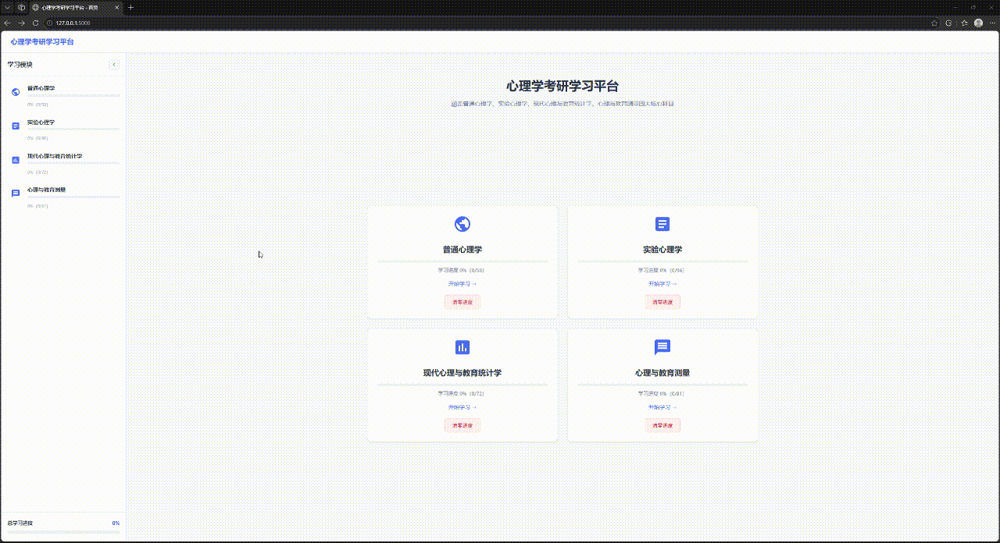

# 心理学考研学习平台

基于 Flask 的心理学考研学习网站，涵盖普通心理学、实验心理学、现代心理与教育统计学、心理与教育测量四大核心科目。项目支持 Markdown 正文、LaTeX 数学公式、章节树导航、考点与习题管理，并提供可直接分发的 Windows EXE 版本，适合作为心理学考研知识整理与练习平台。

## 使用演示



## 功能特性

- 四门核心科目统一管理
- 树形目录导航，支持折叠展开与当前位置高亮
- 正文以 Markdown 存储，前端自动渲染为富文本
- 基于 KaTeX 渲染 LaTeX 公式，支持行内 `$...$`、块级 `$$...$$`、`\(...\)`、`\[...\]`
- 章节正文支持编辑，提供 Markdown / LaTeX 源码编辑与实时预览
- 考点支持新增、编辑、删除
- 习题支持新增、编辑、删除，包含选择题与填空题
- 选择题选项、题干、解析支持公式渲染
- 习题页支持整节统一提交，只有该节题目全部答对才会累计学习进度
- 首页学习模块卡片支持单独清零学习进度
- 首页提供“局域网访问提示”摘要卡片，点击后可展开查看详细说明
- 启动时自动探测本机局域网 IPv4，支持同一局域网内设备访问
- 支持全文搜索与书内搜索
- 提供面包屑导航、上下篇跳转与学习进度接口
- 响应式布局，兼容桌面端与移动端
- 支持使用 `uv` 管理依赖，并可通过 PyInstaller 打包为 EXE

## 技术栈

| 层 | 技术 |
|----|------|
| 后端 | Python 3.12 + Flask 3.x |
| 数据库 | SQLite3 |
| 前端 | 原生 HTML / CSS / JavaScript |
| Markdown 渲染 | marked.js 12.x |
| 公式渲染 | KaTeX 0.16.9 |
| 图表 | Chart.js 4.4.1 |
| 依赖管理 | uv |
| 打包 | PyInstaller |

## 项目结构

```text
PsychologyLearningWeb/
├── app.py
├── launcher.py
├── pyproject.toml
├── uv.lock
├── PsychologyLearningWeb.spec
├── data/
│   ├── psychology_learning.db
│   ├── img/
│   └── readmeImg/
├── utils/
│   └── __init__.py
├── static/
│   ├── css/
│   │   └── style.css
│   ├── fonts/
│   └── js/
│       ├── app.js
│       └── lib/
│           ├── auto-render.min.js
│           ├── chart.umd.min.js
│           ├── katex.min.css
│           ├── katex.min.js
│           └── marked.min.js
├── templates/
│   ├── 404.html
│   ├── base.html
│   ├── book.html
│   ├── index.html
│   └── section.html
├── build/
└── dist/
```

## 数据模型

### books

| 字段 | 类型 | 说明 |
|------|------|------|
| id | INTEGER | 主键 |
| title | TEXT | 书名 |
| short_name | TEXT | 简称 |
| sort_order | INTEGER | 排序 |

### sections

| 字段 | 类型 | 说明 |
|------|------|------|
| id | INTEGER | 主键 |
| book_id | INTEGER | 所属书本 |
| parent_id | INTEGER | 父章节 ID |
| heading_level | INTEGER | 标题层级 |
| heading_text | TEXT | 标题文本 |
| content | TEXT | 正文内容，Markdown 存储 |
| sort_order | INTEGER | 排序 |

### study_points

| 字段 | 类型 | 说明 |
|------|------|------|
| id | INTEGER | 主键 |
| section_id | INTEGER | 所属章节 |
| point_text | TEXT | 考点标题 |
| detail | TEXT | 考点详情 |
| sort_order | INTEGER | 排序 |
| importance | INTEGER | 重要程度 |

### exam_questions

| 字段 | 类型 | 说明 |
|------|------|------|
| id | INTEGER | 主键 |
| section_id | INTEGER | 所属章节 |
| point_id | INTEGER | 关联考点，可为空 |
| question_type | TEXT | 题型，如 `choice`、`fill_blank` |
| question_text | TEXT | 题干 |
| options | TEXT | 选项 JSON，可为空 |
| answer | TEXT | 答案 |
| explanation | TEXT | 解析 |
| sort_order | INTEGER | 排序 |

### section_learning_progress

| 字段 | 类型 | 说明 |
|------|------|------|
| section_id | INTEGER | 主键，对应完成的节 |
| completed_at | TEXT | 完成时间 |

## 开发运行

### 环境要求

- Python 3.12+
- uv

### 安装依赖

```bash
uv sync
```

### 启动项目

```bash
uv run python launcher.py
```

启动后程序会：

- 自动选择可用端口
- 自动打开本机浏览器
- 在首页显示“局域网访问提示”摘要卡片
- 在控制台输出本机访问地址与局域网访问地址

如果只需要传统开发方式，也可以直接运行：

```bash
uv run python app.py
```

## 局域网访问说明

使用 `uv run python launcher.py` 或打包后的 EXE 启动时，程序会监听 `0.0.0.0`，局域网内其他设备可按以下方式访问：

1. 保持本机程序运行，不要关闭程序窗口
2. 确保其他设备与本机连接同一个路由器或同一个 Wi‑Fi
3. 在首页提示卡片或控制台中查看局域网访问地址，例如 `http://192.168.x.x:5000`
4. 在手机、平板或其他电脑浏览器中输入该地址访问
5. 如果 Windows 首次弹出防火墙提示，请允许“专用网络”访问

如果首页提示“当前未检测到可用局域网 IPv4”，说明当前环境暂时无法对局域网提供访问地址。

## EXE 使用

项目已支持打包为无需预装 Python 的 Windows 可执行版本。

### 构建命令

```bash
uv run pyinstaller --noconfirm --clean PsychologyLearningWeb.spec
```

### 产物位置

```text
dist/PsychologyLearningWeb/
├── PsychologyLearningWeb.exe
└── _internal/
```

### 分发方式

- 不要只发送单个 `PsychologyLearningWeb.exe`
- 请把整个 `dist/PsychologyLearningWeb` 目录一起分发给使用者
- 对方电脑无需额外安装 Python 或项目依赖

### EXE 启动行为

- 自动启动本地 Web 服务
- 自动打开默认浏览器
- 首页显示一行摘要的局域网提示，点击后可展开详细说明
- 支持本机访问与局域网访问
- 当前打包版本保留控制台窗口，关闭该窗口会导致服务停止

## 主要页面

- `/`：首页，展示书本、学习进度与局域网访问提示
- `/book/<id>`：书本目录页
- `/book/<short_name>`：按简称访问书本目录页
- `/section/<id>`：章节详情页

## API 接口

### 读取接口

| 接口 | 方法 | 说明 |
|------|------|------|
| `/api/books` | GET | 获取书本列表 |
| `/api/books/progress` | GET | 获取全部书本学习进度 |
| `/api/book/<id>/tree` | GET | 获取书本章节树 |
| `/api/book/<id>/progress` | GET | 获取书本学习进度 |
| `/api/section/<id>` | GET | 获取章节详情 |
| `/api/section/<id>/points` | GET | 获取章节考点 |
| `/api/section/<id>/questions` | GET | 获取章节习题 |
| `/api/search?q=<关键词>` | GET | 全文搜索 |

### 写入接口

| 接口 | 方法 | 说明 |
|------|------|------|
| `/api/section/<id>/update` | POST | 更新章节正文或标题 |
| `/api/section/<id>/submit` | POST | 提交整节习题答案并判定是否完成该节学习 |
| `/api/book/<id>/progress/reset` | POST | 清零指定学习模块的学习进度 |
| `/api/point` | POST | 新增考点 |
| `/api/point/<id>` | PUT | 更新考点 |
| `/api/point/<id>` | DELETE | 删除考点 |
| `/api/question` | POST | 新增习题 |
| `/api/question/<id>` | PUT | 更新习题 |
| `/api/question/<id>` | DELETE | 删除习题 |

## 公式与编辑说明

- 正文、考点、题干、选项、答案、解析均支持公式渲染
- 正文编辑器支持直接输入 Markdown 与 LaTeX
- 可通过工具栏快速插入行内公式与块公式
- 填空题不再单题校验，需在习题页统一点击“提交”完成整节判题
- 只有整节习题全部答对，该节学习进度才会增加 1
- KaTeX 字体资源由应用静态路由提供，避免公式字体加载失败

## 数据来源

内容来源于心理学考研核心教材，经整理后存储于 SQLite 数据库中，用于学习、复习与题目训练。
